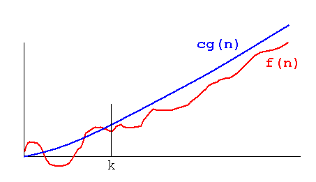

#  
# 알고리즘과 복잡도

CodeSquad Master  
Hoyoung Jung

---
<!-- page_number: true -->
 
# 복잡도(complexity) 분석

- 성능 분석을 위해 사용됨

## 공간복잡도

## 시간복잡도  

---
# Asymptotic notation

- 알고리즘 복잡도를 단순히 표현하기 위해 사용됨
- Big-O 표기법이 가장 유명 

---
# Big-O notation

$$ f(x) = O(g(x)) $$

or if and only if there exist constants N and C such that 

$$ |f(x)| \le C|g(x)|\ for\ all\ x > N $$

---
# Big-O notation

---
# Big-O notation의 의미
- 인풋의 크기가 충분히 커진 상태의 성능
- 최악의 성능을 의미 

## 자주 사용하는 함수
$$O(1), O(log\ n), O(n), O(n\ log\ n), O(n^2), O(2^n), O(n!), O(n^n) $$

---

---
# Cheer Up :+1:
