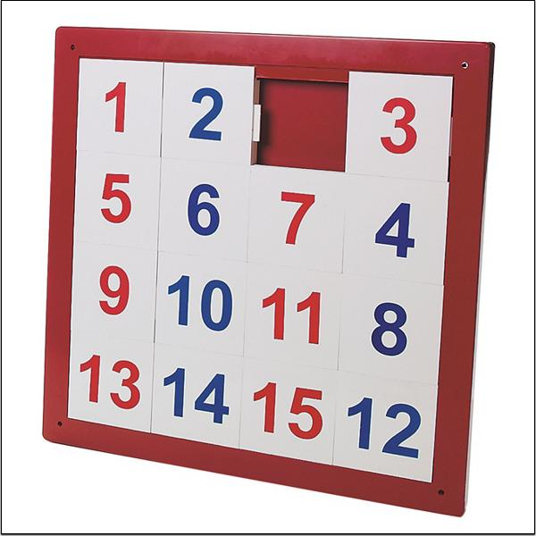

#  
# 자료구조 :crown: 기초 

CodeSquad Master  
Hoyoung Jung

---
<!-- page_number: true -->
# Data Object
데이터를 가지고 있는 오브젝트

# 기본 연산
각 자료구조에서 지원해 주는 연산(operations)들
- Traversing
- Searching
- Insertion
- Deletion
- Sorting
- Merging
- ...

---
# 데이터 타입

## primitive type
-  byte, short, int, long, float, double, boolean, char, String
 (자바기준)

## derived type
- List, Array, Stack, Queue
- Tree, Graph, ... 

---
# 적절한 자료구조의 선택
## 가장 많이 사용하는 자료구조
- Array, List 또는 ArrayList
- Hash, Map, Dictionary, (JS: Object)
- 대부분의 문제를 해결 가능 
## 복합적인 자료구조의 사용도 가능
- 하나의 데이터를 표현하기 위해 복합적인 자료구조도 많이 사용
- ex) ArrayList + HashMap

---
# Array
- 배열, 컨테이너 
- C 언어에서는 동일 크기, 동일 자료형만 담을 수 있는 연속적인 공간
- 요즘 언어에서는 아무거나 다 들어간다.
- 1차원, 2차원, 3차원, ..., n차원 
- 2차원까지를 많이 사용함 

---
# 배열은 언제 사용하나
- 전체를 출력하는 일이 자주 있을 때
- 인덱스를 이용해 값을 빠르게 접근하고 싶을 때
- binarh search
- 정렬 
- 어떤 컨테이너를 써야할지 잘 모를 때

----
# Array Operation
- printAll()
- insert(index, value)
- delete(index)
- get(index) => value
- Search(value) => index
- Update(index, value)
- length() => length 

--- 
# Array 구현 실습
- 직접 구현해 보세요. 

--- 
# Array 연산의 복잡도
- printAll()
- insert(index, value)
- delete(index)
- get(index) => value
- Search(value) => index
- Update(index, value) 1dl
- length() => length 

---
# 도전 과제
## 4 * 4 숫자 퍼즐 구현하기

너무 쉬우면 1024 구현도 됩니다.

---
# 참고 링크 
- https://www.tutorialspoint.com/data_structures_algorithms/data_structures_basics.htm

---
# Cheer Up :+1:

