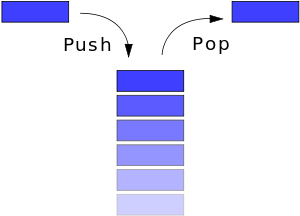
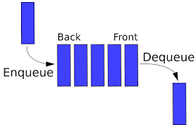

<!-- $theme: default -->

#  
# 자료구조 :crown: 기초 
## 4. 스택과 다른 자료구조들 
<p align='center'>
CodeSquad Master <br>
Hoyoung Jung
</p>

---
<!-- page_number: true -->
# 출석 체크  

---
# 연결 리스트 (Linked List)
https://en.wikipedia.org/wiki/Linked_list


- 노드와 포인터로 연결된 선형 자료구조 
- 노드는 아이템을 담고 있고
- 포인터는 다음 노드로 연결된다. 

---
# 종류
- 싱글 링크드 리스트 
- 더블 링크드 리스트
- 서큘라 리스트
- 더블 서큘라 링크드 리스트 
- 
---
# 오퍼레이션
```
isEmpty()
size()
indexOf(n)
get(index)
insert(index)
delete(index)
AddFirst()
AddLast()
...
```
---
# 구현하기

```
class Node {
  constructor(item) {
    this.item = item;
    this.next = null;
  }
}

class MyList {
  constructor(item) {
    this.head = new Node(item);
    this.length = 0;
  }
```
---
# 센티넬
- 구현을 쉽게 하기 위해서 더미 노드를 추가 

---
# 배열과 리스트의 차이
- 원소의 삽입 삭제가 용이
- 탐색 시간은 더 오래 걸림 


---
# 최근 언어의 List들 
- 레드 블랙 트리를 이용한 구현 
- 해시를 이용한 구현 
등으로 배열과 리스트의 장점을 갖도록 방식으로 구현되는 경우가 많음


---
# 스택 (Stack)

- 대표적인 LIFO 자료구조
- 배열이나 리스트를 이용해 구현 가능



---
# 스택 오퍼레이션
```
isEmpty()
push()
pop()
peek()
size()
...
```

---
# 스택의 활용 
- 함수 호출
- 재귀를 안재귀로 바꿀 때 
- 괄호가 있는 계산식 계산
- 미로 찾기 

---
# 큐 (Queue)
- FIFO (First In First Out)
- 스택과 마찬가지로 배열이나 리스트를 이용해 구현
  

---
# 큐 오퍼레이션
```
enqueue()
dequeue()
```

---
# 큐의 용도
- 작업 큐(?) 
- 트리 탐색
- 시뮬레이션 

---
# 해시 테이블
- 해시함수를 이용해 빠르게 자료를 찾을 수 있는 자료구조
- 검색에 평균 O(1) 시간이 소요됨


---
# 해시테이블 오퍼레이션
```
put(key, value)
get(key) 
size()
```
일반적으로 해시테이블은 이터레이션을 제공해 주지 않음

---
# 해시 함수 
- 데이터를 고르게 분산시켜야 함 

---
# 충돌
- h(k1) == h(k2) 가 True인 상황 
- 충돌이 발생하는 걸 막기는 어려움
- 좋은 해시 함수의 조건: 충돌이 적게 발생할 것  
- 충돌 해결법으로는 체이닝과 선형조사등이 있음 
- http://d2.naver.com/helloworld/831311

---
# 해시테이블의 용도
- 리스트와 더불어 가장 중요한 자료구조 
- 딕셔너리, 맵, 오브젝트 등의 구현에 사용됨
- 레드 블랙 트리로 구현되는 경우도 있음 

---
Thank you :+1: