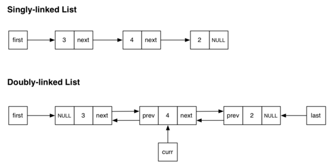

<!-- $theme: default -->

#  
# 자료구조 :crown: 기초 
## 5. 더블 링크드 리스트  
<p align='center'>
CodeSquad Master <br>
Hoyoung Jung
</p>

---
<!-- page_number: true -->
# 출석 체크 및 알고리즘 문제 풀이 
https://www.hackerrank.com/domains/data-structures/linked-lists/page:1


---
# 더블 링크드 리스트 (Doubly Linked List)


---
# 코드 
```
class Node {
	var value
    var 
}
class DoubleLinkedList 
init()
AddFirst()
AddLast()

```
---
## The code

