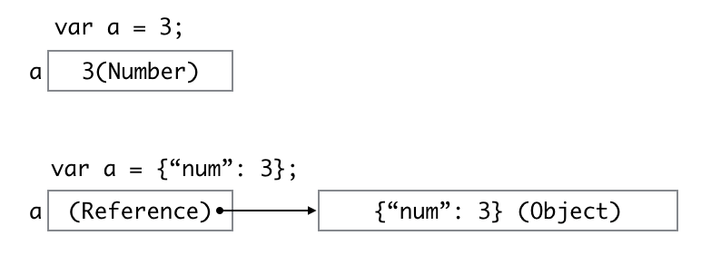

#  
# 자료구조 :crown: 기초 
## Call by Reference 

<p align='center'>
CodeSquad Master <br>
Hoyoung Jung
</p>

---
<!-- page_number: true -->
# Call by Value 
* 함수를 호출하면 매개변수를 함수 내부로 전달
* 이 때 변수의 값을 복사해서 전달하는 방식 
* 대부분의 언어에서 기본 데이터 타입을 전달하면 발생

---
# ex1 - js
```javascirpt
var foo = function(num) {
    num++;
    console.log(`num: ${num}`); //6
}

var a = 5;
foo(a);
console.log(`a: ${a}`); //5
```

---
# ex1 - swift
```
func foo(num:Int)
{
    // num += 1 ,this is error on Swift
    let num2 = num + 1
    print("num2: \(num2)")
}

var a = 5
foo(num: a)
print(a)
```
오해의 소지가 없도록 Swift에서는 parameter 값 변경이 불가능합니다!

---
# ex2 - js
```
var foo = function(str) {
    // str += " world";
    str = str.concat(" world");
    console.log(`str: ${str}`); 
}

var a = "hello";
foo(a);
console.log(`a: ${a}`); 
```
js는 string도 call by value로 호출

---
# ex2 - swift
```
var a = "hello"
func foo2(s:String)
{
    //s += " world" error
    let s2 = s + " world";
    print(s2)
}

foo2(s: a)
print(a)
```

---
# ex3 - js
```javascript
var a = 5;
var b = a;
var a = a + 5;
console.log(a); //10
console.log(b); //5
```
`b = a;` 구문에서도 값 복사가 일어남 

---
# ex3 - swift
```swift
var a = 5
var b = a
var a = a + 5
print(a)
print(b)
```
`b = a` 구문에서도 값 복사가 일어남 


---
# 참조(reference)란?
- 실제 변수가 아니라 간접적으로 변수에 접근하는 방법 
- JS: 기본 타입이 아닌 객체를 생성하면 참조 변수가 만들어짐 
	- 배열, 오브젝트, ...
- Swift
	- class: 참조 생성
	- struct: 기본은 값 복사지만 참조도 사용 가능
	- 배열, 딕셔너리, 스트링 모두 struct

---
# Reference(참조)



---
# ex4.js
```
var a = {"score": 0};
var b = a; //참조 
a.score = 60;
console.log(a); //60
console.log(b); //60
```

---
# ex4.swift
```
class MyClass {
    var num: Int
    init(num: Int) {
        self.num = num
    }
}

var a = MyClass(num: 0)
var b = a
a.num = 50
print(a.num, b.num) //50 50
```
---
# ex4-val.swift
```
struct Score {
    var num = 0
}

var s1 = Score(num: 10)
var s2 = s1 //copy by value
s1.num = 20
print(s1, s2) //20 10
```
- (주의!) struct의 경우 값 복사를 함
- Array와 Dictonary도 struct의 일종!

---
# Call by Reference  
- 함수 호출시 매개변수가 참조일 경우 참조를 전달 
- 원본 객체에 변경값이 반영됨

---
# ref.js
```
function accel(car) {
	car.speed += 50;
}
var c = {"name": "bmw", "speed": 0};
accel(c);
console.log(c); //{ name: 'bmw', speed: 50 }
```
---
# ref.swift
```swift
class Car {
    var name = "bmw"
    var speed = 0
    }

func accel(car: Car) {
    car.speed += 50
}

var a = Car()
print(a.name, a.speed) //bmw 0
accel(car: a)
print(a.name, a.speed) //bmw 50
```

---
# ref2.swift
```swift
struct Car {
    var name = "bmw"
    var speed = 0
}

func accel(car:inout Car) {
    car.speed += 50
}

var a = Car()
print(a.name, a.speed) //bmw 0
accel(car: &a)
print(a.name, a.speed) //bmw 50
```
- `car:inout Car` 구문과  `accel(car: &a)`에 주의할 것!  
---
# array.js
```
function foo(arr) {
	arr.push(255);
}

var arr = [1,2,3]
foo(arr)
console.log(arr); //1,2,3,255
```
- 배열, 오브텍트는 call by reference로 호출됨

---
# array.swift
```
func foo( arr:inout Array<Int>) {
    arr.append(255)
}

var a = [1,2,3]
foo(arr: &a)
print(a) //1, 2, 3, 255
```
- 배열이나 딕셔너리도 `inout` 및 `&`가 필요합니다! 
---
# dictionary.swift
```
var a = [String: String]()

func foo(addr:inout [String:String])->Bool{
    addr["honux"] = "Seoul"
    return true
}

print(foo(addr: &a))
print(a) //["honux": "Seoul"]
```

---
# quiz1.js
```
a = [1,2,3]
b = a
a.push(4)
console.log(b)
```

---
# quiz2.js
```
a = [1,2,3]
b = a
a.push(4)
a = [5,6,7]
b.push(5)
console.log(a)
console.log(b)
```

---
# quiz3.js
```
fuction foo(arr) {
    arr.push('foo');
    arr = [4,5,6];
    arr.push('bar');
    console.log(arr);
}
var a = [1,2,3];
foo(a);
console.log(a);
```

---
# quiz1.swift
```
var a = [1,2,3]
var b = a //value copy
a.append(4)
print(a)
print(b)
```
- array가 struct라는 사실을 확인할 수 있음!

---
# quiz2.swift
```
class People {
    var name = "Jhon Doe"
}

var a = People()
var b = a
a.name = "Sara Jane Smith"
print(a.name, b.name)
a = People()
print(a.name, b.name)
```

---
# quiz3.swift
```
class People {
    var name = "Jhon Doe"
}

func foo(people: People) {
    people.name = "Doctor Who"
    print(people.name)
}

func bar(people:inout People) {
    people = People()
    people.name = "Dalek"
}

var a = People()
foo(people: a)
print(a.name)
bar(people: &a)
print(a.name)
```
bar 같은 코드는 짜면 좋지 않습니다. 

---
# 참고 링크 

- https://developer.mozilla.org/ko/docs/Web/JavaScript/Reference/Statements/const
- https://github.com/apple/swift-evolution/blob/master/proposals/0003-remove-var-parameters.md


---
# Cheer Up :+1:
