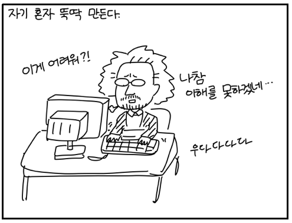
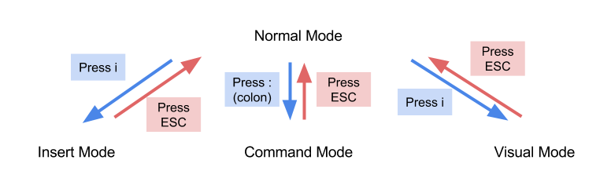

<!-- page_number: true -->
#  Learn Vim Basic
<p align='center'>
CodeSquad Master <br>
Hoyoung Jung
</p>

---
<!-- page_number: true -->
# History
1. 천재 개발자 Bill Joy가 vi를 만듬 
2. vim으로 발전됨 


---
<!-- page_number: true -->
# Vim 
- Vi Improved
- 텍스트 에디터 
- 매우 강력함 
- 간지!
- 진입장벽이 조금 높다 
### 세상에는 Vim을 사용할 수 있는 개발자와 그렇지 않은 개발자가 있다. 

---
<!-- page_number: true -->
# 잠깐 키를 익히자
http://vim-adventures.com/

### 혹시 Rogue를 아시나요? 

---
<!-- page_number: true -->
# 직접 해 보자
```
$ vim hello.html 
```
i를 누르고 입력시작 
적당히 문장을 입력해 봅시다. 
i는 입력모드로 전환하는 키 
### i를 누르면 입력모드가 된다! 

---
<!-- page_number: true -->
# 일반 모드 
입력을 다 한 후에는 <kbd>esc</kbd>를 눌러 보자.
일반모드에서는 <kbd>h</kbd><kbd>j</kbd><kbd>k</kbd><kbd>l</kbd> 키를 방향키로 쓸 수 있음 
방향키도 되긴 되지만 비추 
### <kbd>esc</kbd>를 누르면 일반모드가 됨

---
<!-- page_number: true -->
# 일반 모드에서 할 수 있는 것들

커서이동 <kbd>h</kbd><kbd>j</kbd><kbd>k</kbd><kbd>l</kbd>
삭제 <kbd>x</kbd> 또는 <kbd>X</kbd>
이동: e, w, b, $, ^, gg, G 
삭제: dd, dw, 3dw, 5dd
입력모드로: i, I, o, O, a, A
복사: yy
붙여넣기: p

---
<!-- page_number: true -->
# 명령 모드
일반 모드에서 <kbd>shift</kbd> + <kbd>;</kbd> 을 누르면 명령모드가 된다. 

---
<!-- page_number: true -->
명령 모드에서 할 수 있는 것들
:w 저장
:q 종료
:q! 저장 안하고 종료 
:wq 저장하고 종료 

---
<!-- page_number: true -->
# Vim의 모드
- vim에는 여러 모드가 존재
- 입력 모드, 명령 모드, 비쥬얼 모드 



---
<!-- page_number: true -->
# 혼자서 공부하기 

터미널에서 아래 명령 입력 
```bash
$ vimtutor
```
다른 학습 사이트들 

http://codelion.net/weeks/overview/2
http://www.openvim.com/

---
<!-- page_number: true -->
# 간단하게 vim을 사용하는 법을 배웠습니다.
### Thank You 