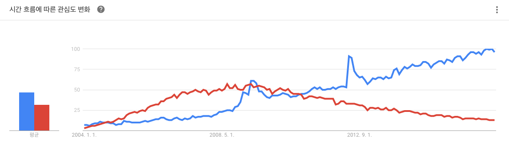

<!-- page_number: true -->
#  Learn Git Basic

CodeSquad Master  
Hoyoung Jung

---
<!-- page_number: true -->
# Git이란?
1. svn과 같은 VCS (Version Control System) 
2. Linus Torvals가 리눅스의 소스 코드 버전 관리용으로 만듬
3. github, 안드로이드와 함께 점점 더 유명해짐

---
<!-- page_number: true -->
# Why VCS?
1. 소스 저장소: usb, 드롭박스, DVD?
2. 협업은 어떻게?
3. 버전 관리는?
4. 문제가 생겼을 때 롤백은 어떻게 할까? 
5. 오픈 소스? 

---
<!-- page_number: true -->
# git vs svn
|  git |svn   |
|---|---|
|어렵다.   | 덜 어렵다.    |
| 빠르다.  | 덜 빠르다.  |
| 오프라인 작업 가능  | 온라인 상태에서만 작업 가능   |
| 풍부한 브랜치 기능 |  브랜치 기능 미비 |

---
<!-- paœge_number: true -->
#시작하기
1. 다운로드 (https://git-scm.com 및 설치
   - 맥은 다운로드 불필요, 터미널을 열고 git 입력 후 엔터 
2. 환경 설정(이름, 이메일)
3. source tree 설치 (https://www.sourcetreeapp.com/)

---
<!-- paœge_number: true -->
#시작하기

---
<!-- paœge_number: true -->
# 더 공부하기
- http://www.slideshare.net/ibare/dvcs-git
- 
- https://backlogtool.com/git-guide/kr/ 
- http://danielkummer.github.io/git-flow-cheatsheet/index.ko_KR.html 
