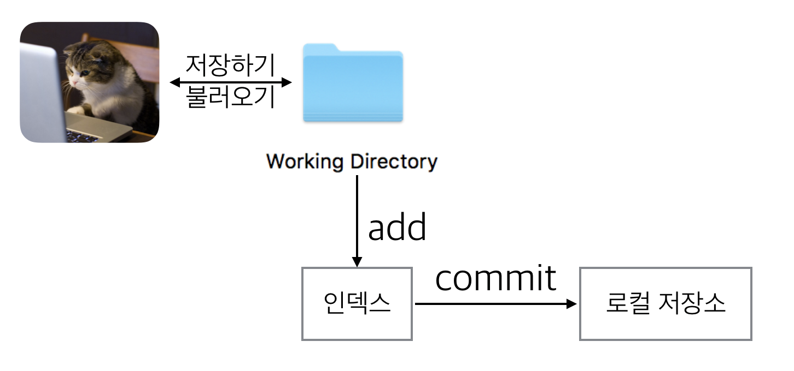
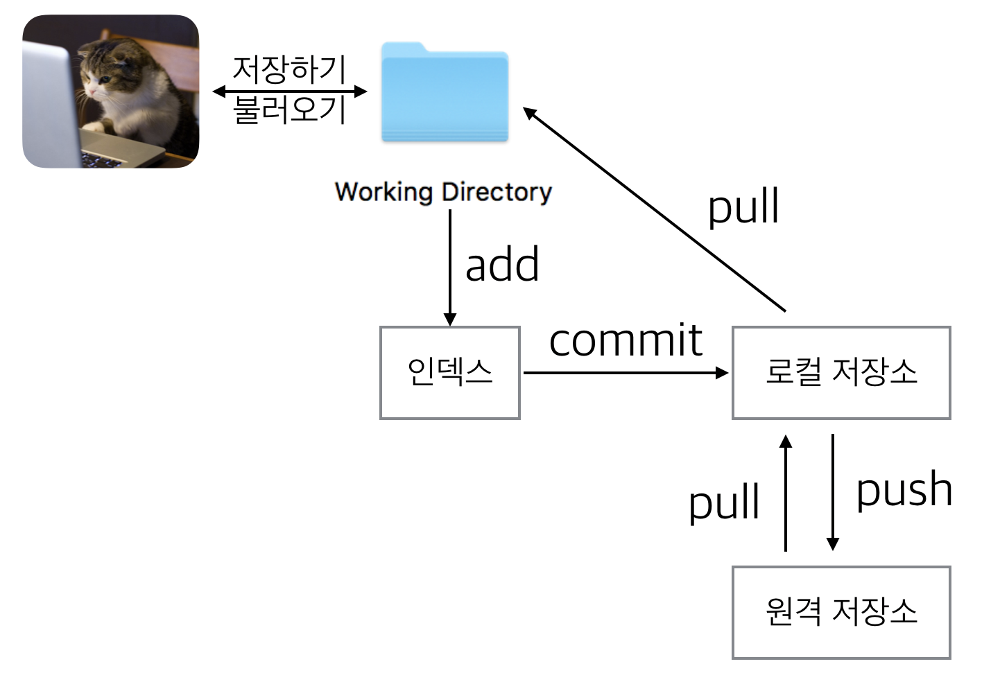

<!-- page_number: true -->
#  
# Learn Git Basic 1
<p align='center'>
CodeSquad Master <br>
Hoyoung Jung
</p>

---
<!-- page_number: true -->
# Git이란?
1. svn과 같은 VCS (Version Control System) 
2. Linus Torvals가 리눅스의 소스 코드 버전 관리용으로 만듬
3. github, 안드로이드와 함께 점점 더 유명해짐


---
<!-- page_number: true -->
# Why VCS?
1. 소스 저장소: usb, 드롭박스, DVD?
2. 협업은 어떻게?
3. 버전 관리는?
4. 문제가 생겼을 때 어떻게 되돌릴까? 
5. 오픈 소스? 

---
<!-- page_number: true -->
# 요약 
## git으로 파일을 관리하면 변경 이력이 다 남습니다. 
백업 복사본 이런 거 만들 필요도 전혀 없고, 공동 작업도 정말 쉬워집니다! 

---
<!-- page_number: true -->
# git vs svn
|  git |svn   |
|---|---|
|어렵다.   | 덜 어렵다.    |
| 빠르다.  | 덜 빠르다.  |
| 오프라인 작업 가능  | 온라인 상태에서만 작업 가능   |
| 풍부한 브랜치 기능 |  브랜치 기능 미비 |

---
<!-- page_number: true -->
# 시작하기
1. 다운로드 (https://git-scm.com 및 설치
   - 맥은 다운로드 불필요, 터미널을 열고 git 입력 후 엔터 
2. 환경 설정(이름, 이메일)
3. source tree 설치 (https://www.sourcetreeapp.com/)

---
<!-- page_number: true -->
# 작업 디렉토리
사람이 직접 파일을 변경하는 곳 
에디터, IDE 등을 통해 파일 내용을 직접 변경할 수 있다. 


---
<!-- page_number: true -->
# 로컬 저장소
작업 디렉토리의 작업 변경 내용을 저장하는 곳
git 명령어로 생성 및 조작 가능
내 컴퓨터에 숨김폴더로 저장됨 


---
<!-- page_number: true -->
# 원격 저장소
로컬 저장소를 서버에 복사해서 저장하는 곳을 원격 저장소라고 합니다.
여려 명이 협업하기 위해서 필요하고
로컬 저장소가 없어졌을 때 복구하기 위해서도 필요합니다.


---
<!-- page_number: true -->
# 글로벌 사용자 등록 
```
$ git config --global --edit
$ git config --global user.name = 'Hoyoung Jung'
$ git config --global user.name
$ git config --global user.email = 'honux@codesquad.kr'
$ git config --global user.email
```
전체 계정의 이메일과 이름을 저장합니다.

---
<!-- page_number: true -->
# git 시작하는 방법 
### = 로컬 저장소를 만드는 방법

1. git 명령으로 새로운 [empty] 저장소를 만든다.
2. 이미 있는 원격 저장소를 복사해 온다. 

---
<!-- page_number: true -->
# 새로운 로컬 저장소 만들기 
```bash 
$ mkdir git-proj
$ cd git-proj
$ git init .
$ ls -al
```

---
<!-- page_number: true -->
# git 저장소 상태 보기
```
$ git status
```
많은 git 명령은 작업 디렉토리가 git 로컬 저장소와 연결된 경우에만 사용 가능  

---
<!-- page_number: true -->
# 꿀팁: 로컬 프로젝트 세팅
```
$ vi .git/config 
$ git config user.name 
$ git config user.email 
```
로컬 설정은 글로벌 설정보다 우선순위가 높습니다. 

---
<!-- page_number: true -->

# 커밋
커밋이란 작업 디렉토리 변경 내용을 로컬 디렉토리에 반영하는 것 
```bash
$ echo "some text" > text.txt
$ git status
$ git add text.txt
$ git status 
$ git commit -m " Add text.txt"
$ git status
$ git log 
$ git log --oneline 
$ git log --oneline --decorate --graph
```

---
<!-- page_number: true -->

# 인덱스
인덱스: 작업 디렉토리와 로컬 저장소 사이에 위치
스테이징 영역이라고 함
<b>인덱스에 있는 내용만 로컬 저장소에 커밋 가능!</b>

```
$ git add 파일이름 #해당 파일의 변경 내용을 인덱스에 추가함 
```


---
<!-- page_number: true -->

# 실습 
1. 임의의 디렉토리 만들기 
2. 비어 있는 git project 생성 [x]
3. 간단한 프로그램 만들기 (구구단? 달력? 별로 모래시계 만들기?) [x]
4. 다섯 번 이상 커밋하기 [x]
5. 수시로 git status 와 git log 사용해 보기 [x]


---
<!-- page_number: true -->
# 커밋
커밋이란 git의 객체 
변경이력이자 git에서 가장 중요한 것
모든 커밋은 고유한 아이디를 갖는다. 
아이디는 긴 16진수인데 보통 앞의 5자리 정도만 사용해도 유니크함


### 그림에서 궁금한 점? 

---
<!-- page_number: true -->
# 로컬 저장소 원격 저장소에 복사하기


---
<!-- page_number: true -->
 
#  git push
github에 로그인하고 test 프로젝트를 만듭니다.
만들고 주소를 확인 

```
$ git remote add origin 저장소주소
$ git remote -v 
$ git log --oneline --decoreate --all 
$ git push 
```
git push: 로컬 저장소를 원격 저장소에 복사하는 명령

---
<!-- page_number: true -->
# 팁: mac에서 push가 잘 안 될 경우 
에러가 발생할 경우 아래처럼 저장소 주소에 github id를 추가합니다.

```
[remote "origin"]
  url = https://honux77@github.com/honux77/practice
```

---
<!-- page_number: true -->

# git clone
새로운 폴더를 생성하고 원격 저장소를 복사해 오는 명령
```
$ MYDIR=적당한디렉토리위치
$ cd $MYDIR
$ git clone 원격저장소주소
$ ls
```

--- 
<!-- page_number: true -->

# git pull
원격 저장소의 내용을 로컬 저장소에 복사하고
현재 작업 디렉토리까지 내용을 반영 
```
git pull
```



---
<!-- page_number: true -->
# 병합하기

서로 다른 커밋을 합치기 위해 사용
merge 와 rebase 명령을 통해 자동으로 해결
가끔 자동이 안 되는 경우 수동으로 해결함 


---
<!-- page_number: true -->
# 충돌 
자동으로 병합이 안 되는 상황을 충돌(conflict)라고 함 
서로 다른 커밋이 동시에 같은 파일을 수정했을 경우 발생
```
$ git merge 다른커밋 
# conflict 발생
$ vi 충돌파일 
$ git commit 
```
에디터나 툴로 수동으로 고친 후 커밋으로 해결 가능 

--- 
<!-- page_number: true -->

# 실습 
1. 커밋한 프로젝트 push 하기
2. 짝의 프로젝트 clone 하기 
3. 짝의 프로젝트 살짝 헤집어 놓기 (커밋 3개 이상)
4. 짝의 프로젝트 push 하기 
(에러 발생? 알아서 해결해 보자!)
5. 내 프로젝트로 돌아와서 추가 커밋하기
6. 내 프로젝트 git pull 
7. ??

---
<!-- page_number: true -->
# 더 공부하기
- http://www.slideshare.net/ibare/dvcs-git
- 
- https://backlogtool.com/git-guide/kr/ 
- http://danielkummer.github.io/git-flow-cheatsheet/index.ko_KR.html 
