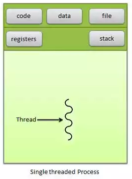
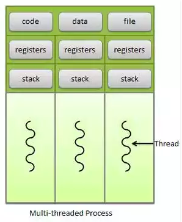

<!-- page_number: true -->
#  
# 프로세스, 스레드, 메모리  

CodeSquad Master  
Hoyoung Jung

---
<!-- page_number: true -->
# 컴퓨터

- 코드를 실행하는 기계 
- 코드란 무엇인가? 
- 코드는 어디서 어떻게 실행되는가? 

---
<!-- page_number: true -->
# 용어부터 알고 넘어갑시다.
- CPU
- Memory
- Register 
- L1, L2 Cache 
- Secodary Storage 
- PC (프로그램 카운터)

---
<!-- page_number: true -->
# 운영체제는 무엇인가요?
## 커널
## 시스템콜 

---
<!-- page_number: true -->
# 프로세스와 메모리 
- 프로세스란? 실행중인 프로그램 
- 프로세스는 어떤 상태를 가질까?
- 코드, 스택, 힙, 데이타 영역이란?

---
<!-- page_number: true -->
프로세스에는 항상 하나 이상의 쓰레드가 있습니다.

---
<!-- page_number: true -->
# 쓰레드
- 프로그램 실행을 스케쥴링하는 가장 작은 단위. 
- 보통 한 프로세스 안에 여러 스레드를 가질 수 있다. 
- Single threading VS multithreading?

---
<!-- page_number: true -->
# GUI 프로그램과 멀티스레드 
- GUI에서 main thread의 역할 
- 다운로드를 누르면 1분동안 IO 작업을 하는 프로그램을 싱글쓰레드로 구현한다면? 

https://developer.android.com/training/articles/perf-anr.html

---
<!-- page_number: true -->
# Thanks :+1:

