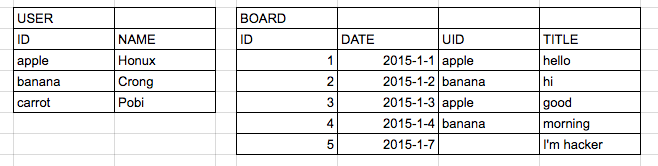

<!-- page_number: true -->
  
# DBMS Basic : Join
<p align='center'>
CodeSquad Master <br>
Hoyoung Jung <br>
</p>

<p align='right'> </p>

---
# 실습 
아래 내용으로 테이블을 만들어 봅시다.


---
# 외래 키 
BOARD 테이블에서는 USER 테이블 레코드의 참조가 발생,
이 때 사용하는 USER의 UID 값을 외래 키라고 합니다. 


---
https://gist.github.com/honux77/1d0899dc8efcd90eff98bbf82eca7707
```
DROP TABLE IF EXISTS USER;
CREATE TABLE USER (
	ID VARCHAR(32),
	NAME VARCHAR(32) NOT NULL,
	PRIMARY KEY(ID)
	);

INSERT INTO USER VALUES 
('apple', 'honux'),('banana','crong'),('carrot','pobi');
```
---
```
DROP TABLE IF EXISTS BOARD;
CREATE TABLE BOARD(
	ID INT NOT NULL AUTO_INCREMENT,
	DATE DATE,
	UID VARCHAR(32),
	TITLE VARCHAR(64) NOT NULL,
	PRIMARY KEY(ID),
	FOREIGN KEY(UID) REFERENCES USER(ID)
        ON DELETE CASCADE ON UPDATE CASCADE);	

INSERT INTO BOARD (DATE, UID, TITLE) VALUES 
	('2015-1-1','apple', 'hello'), 
	('2015-1-2','banana', 'hi'), 
	('2015-1-3','apple', 'good'), 
	('2015-1-4','banana', 'zizi'), 
	('2015-1-3',NULL, 'I am hacker');
    
DESC USER;
DESC BOARD;
	
SELECT * FROM USER;
SELECT * FROM BOARD; 
```

---
# Cross Join 
카테시안 프로덕트라고 하기도 하며 가능한 모든 쌍을 나타냄 
```
SELECT * FROM USER CROSS JOIN BOARD;
```
어떤 의미가 있을까요? 

---
# Inner Join 
```
SELECT * FROM USER U CROSS JOIN BOARD B 
	WHERE U.ID = B.UID;

SELECT * FROM USER U INNER JOIN BOARD B ON U.ID = B.UID;

SELECT * FROM USER U JOIN BOARD B ON U.ID = B.UID;
```
약간의 정보 손실이 발생합니다.

---

# Left Outer Join
```
SELECT * FROM USER U LEFT JOIN BOARD B ON U.ID = B.UID;
```

---
# Right Outer Join
```
SELECT * FROM USER U RIGHT JOIN BOARD B ON U.ID = B.UID;
```

---
# 참조 무결성 제약 조건
외래키 컬럼의 값은 반드시 참조 대상 테이블의 Primary Key 값이거나 NULL 값이어야 합니다.

---
# ON DELETE CASCADE, ON UPDATE CASCADE
참조대상 테이블에서 삭제 또는 변경이 일어날 때 참조되는 레코드 값도 함께 삭제 또는 변경이 일어나도록 지정 
```
UPDATE USER SET ID='blueberry' WHERE ID='banana';
SELECT * FROM BOARD;
DELETE FROM USER WHERE ID='apple';
SELECT * FROM BOARD;
```

---
# Index와 효과적인 탐색 
- Primary Key, Foreign Key 컬럼에는 기본적으로 Index가 자동으로 생성됨
- 삽입시 성능 저하
- 검색 및 조인시 성능 향상 

---
# Entity-Relationship 모델
- 개체와 관계를 이용해 데이터를 표현하는 방식
## Entity
- 실생활에서 독립적으로 존재하는 어떤 것 
- 프로그래밍에서의 Object와 유사한 개념 
## Relationship
- 객체와 객체 사이의 관계를 표현

---
# Relational 모델 
ER 모델은 물리적 저장에 적합한 모델이 아니므로 이를 저장하기 적합한 관계형 모델로 변환함

##  Entity와 Relationship의 물리적 표현 
- 모두 테이블을 통해 저장됨 

---
# 관계의 종류 
- one to one
	- one to one 관계는 일반적으로 다른 객체에 포함시킴 
- one to many
    - 일반적으로 자주 발생하는 관계 
- many to many
    - many to many 를 표현하기 위해서는 추가적인 테이블 생성 필요
    - 사용자 to 아이템 

---
# many to many 실습 
다음 관계를 처리할 수 있도록 추가적인 테이블을 만들어 봅시다.
- 유저는 다수의 아이템을 소지 가능
- 한 아이템은 복수의 유저에 의해 소유됨 
- 소유한 아이템은 개별로 내구도(DURABILITY), 강화(ENCHANT)의 속성을 추가로 가짐
```
USER(ID, NAME, MONEY) 
ITEM(ID, NAME, PRICE)
```

---
# 더 공부하기

- http://www.w3schools.com/Sql/default.asp
- https://www.hackerrank.com/domains/sql/select 
- http://dev.mysql.com/doc/refman/5.7/en/introduction.html

